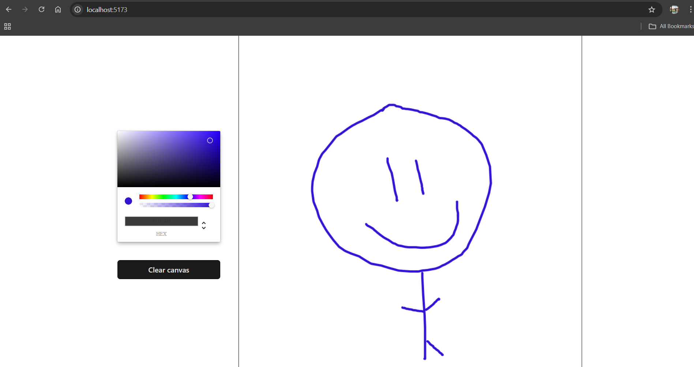
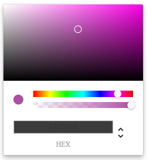

# TS-Paint: Real-Time Collaborative Drawing Application

A modern, web-based collaborative drawing application built with TypeScript and React. This project demonstrates real-time collaboration capabilities using WebSocket technology, allowing multiple users to draw on the same canvas simultaneously.

This project was inspired by a tutorial from @joshtriedcoding on YouTube (link: https://youtu.be/Dib5TYHHfgA).



## 🚀 Features

- Real-time collaborative drawing
- Color picker integration
- Smooth line drawing with custom brush settings
- Canvas state synchronization across clients
- Clear canvas functionality
- Responsive design with Tailwind CSS

## 🛠️ Technology Stack

- **Frontend:**
  - React 18
  - TypeScript
  - Vite
  - Tailwind CSS
  - Socket.IO Client
  - React Color (Chrome Picker)

- **Backend:**
  - Node.js
  - Express
  - Socket.IO
  - TypeScript

## 🏗️ Architecture

The application follows a client-server architecture:


### Key Components

1. **Canvas Drawing System**
   - Custom hook (`useDraw`) for handling drawing mechanics
   - Real-time point tracking and line rendering
   - Event-based drawing state management

2. **WebSocket Communication**
   - Bidirectional real-time updates
   - Canvas state synchronization
   - Drawing event broadcasting

3. **State Management**
   - Efficient drawing state handling
   - Color selection persistence
   - Canvas synchronization across clients

## 🚦 Getting Started

### Prerequisites

- Node.js (v14 or higher)
- npm or yarn package manager

### Installation

1. Clone the repository:
```bash
git clone https://github.com/noahkrem/ts-paint.git
cd ts-paint
```

2. Install dependencies for both client and server:
```bash
# Install client dependencies
cd client
npm install

# Install server dependencies
cd ../server
npm install
```

3. Start the development servers:

```bash
# Start the server (from server directory)
npm run server

# Start the client (from client directory)
npm run client
```

4. Open your browser and navigate to `http://localhost:5173`

## 🎨 Usage

Click on the GIF below to see a demo of the application in action:


1. **Drawing:**
   - Click and drag on the canvas to draw
   - Use the color picker to select different colors
   - Lines are drawn in real-time and visible to all connected users

2. **Collaboration:**
   - Share the URL with others to draw together
   - All changes are synchronized in real-time
   - Canvas state is preserved for new users joining

3. **Canvas Management:**
   - Use the "Clear canvas" button to reset the drawing area
   - All connected users will see the canvas clear

## 🧪 Technical Implementation

### Real-Time Drawing Logic
```typescript
function createLine({ prevPoint, currentPoint, ctx }: Draw) {
  socket.emit('draw-line', ({prevPoint, currentPoint, color}))
  drawLine({ prevPoint, currentPoint, ctx, color })
}
```

The drawing system uses a combination of Canvas API and Socket.IO to achieve smooth, real-time drawing capabilities.

### State Synchronization
The application maintains drawing state consistency across clients through:
- Initial canvas state transfer
- Real-time drawing event broadcasting
- Automatic state recovery for new connections

## 🤝 Contributing

Contributions are welcome! Please feel free to submit a Pull Request.

1. Fork the repository
2. Create your feature branch (`git checkout -b feature/AmazingFeature`)
3. Commit your changes (`git commit -m 'Add some AmazingFeature'`)
4. Push to the branch (`git push origin feature/AmazingFeature`)
5. Open a Pull Request

## 🎯 Future Improvements

- [ ] Add different brush types and sizes
- [ ] Implement undo/redo functionality
- [ ] Add layer support
- [ ] Save/load drawings
- [ ] Add user authentication
- [ ] Mobile device support
- [ ] Export canvas as image

## 📸 Screenshots

### Main Interface


### Color Selection


### Collaborative Drawing

Click on the GIF below to see collaborative drawing in action:


<!-- To be added when available
## 🔗 Links

- [Live Demo](#) *(Add when available)*
- [Documentation](#) *(Add when available)*
- [Bug Tracker](#) *(Add when available)*
-->

## ✨ Acknowledgments

- @joshtriedcoding on YouTube for the inspiration and tutorial on building a similar project (link: https://youtu.be/Dib5TYHHfgA)
- Socket.IO team for the excellent real-time engine
- React team for the robust frontend framework
- The open-source community for various tools and libraries

---